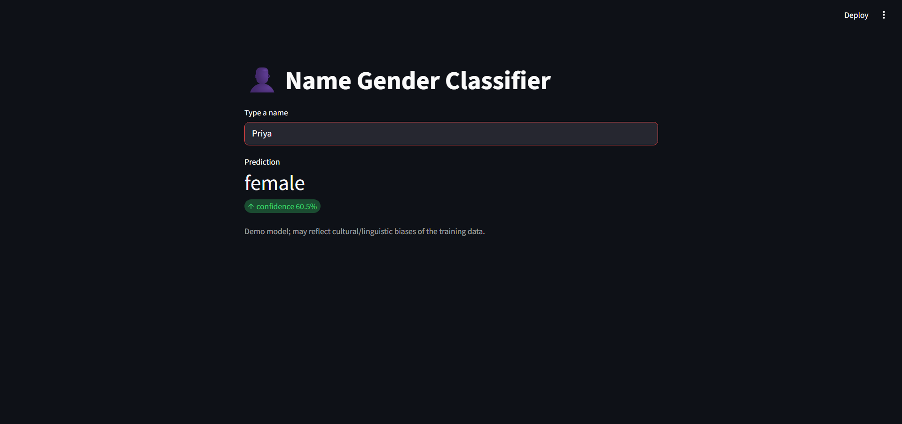

# Name Gender Classifier

This project predicts the gender (male/female) of a given name using machine learning.  
It includes a Streamlit web app for easy interaction.

## Features
- Trains a classifier on a dataset of names and genders
- Interactive web interface with Streamlit
- Confidence score for each prediction

## Installation

```bash
git clone https://github.com/Harinisai1111/name-gender-classifier.git
cd name-gender-classifier
python -m venv .venv
.venv\Scripts\activate  # On Windows
pip install -r requirements.txt
```

## Usage

**Train the model:**
```bash
python train.py
```

**Run the web app:**
```bash
streamlit run streamlit_app.py
```

Open the URL shown in your terminal to use the app.

## Example

 <!-- Add a screenshot if you have one -->

## Requirements

- Python 3.8+
- scikit-learn
- pandas
- streamlit
- joblib
- nltk

## License

MIT License